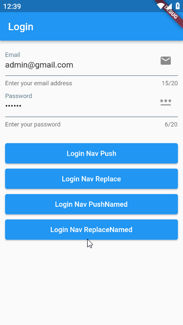

# flutter_navigation1

## Previews

### 1. Login View

### 2. Dialog - Snackbar - BottomSheet 

### 3. GO Router - Navigator 2.0 

### 4. Go Router on Web Mode

## Getting Started

This project is a starting point for a Flutter application.

A few resources to get you started if this is your first Flutter project:

- [Lab: Write your first Flutter app](https://docs.flutter.dev/get-started/codelab)
- [Cookbook: Useful Flutter samples](https://docs.flutter.dev/cookbook)

For help getting started with Flutter development, view the
[online documentation](https://docs.flutter.dev/), which offers tutorials,
samples, guidance on mobile development, and a full API reference.
